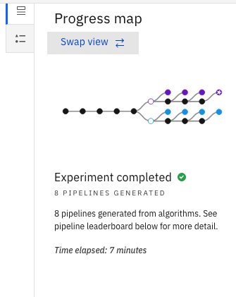

# Build a multiclass classification model by running an AutoAI experiment

For this part you will use an existing dataset from the Watson Gallery.

1. Login to Watson Studio and navigate to the gallery:

  

1. Select the dataset "**UCI: car evaluation**"

  

  This dataset includes 6 attributes someone would consider when purchasing a vehicle:
  + The purchase price, the maintenance cost, the number of doors, the passenger capacity, the size of the luggage area, and the safety rating.
  + The last column is the evaluation for each vehicle: acceptable, good, unacceptable or very good. This is later going to be the column we want to **predict**.

  
1. Add this dataset to your existing Watson Studio project.
    

    Then View the project. In the Asset tab, you'll see the dataset.
1. Now, add to your project the AutoAi experiment. Click **Add to project** -> **AutoAI experiment**
  
  

1. You should already have a Watson Machine Learning Service Instance associated to your project.
> If you haven't create and associated a Watson Machine Learning (WML) Service instance to your project please do so right now clicking on **New** for WML Service.  

  Provide a name to the experiment and click **Create**

4. You now need to load the data, in this case the dataset can loaded from the project. Select The Car Evaluation CSV file from the list.
AutoAI reads the dataset and lists the columns found in the dataset.
In this case you want to select **Evaluation** as the column to predict.
    

1. Now edit the **Experiment settings**.

  + First look at setting for the **Data source**.
  If you have a large dataset, you can chose to run the experiment on a subsample of rows.
  > AutoAI accepts files up to 1Gb.  

  + You can configure how much of the data would be used for training and how much would be used for model evaluation.
  The default is a *90% - 10%* split where 10% of data is reserved for evaluation.
  + You can also select which columns of the dataset to include when running the experiment.

  + On the **Prediction** panel you can select a prediction type.
  In this case, the evaluation column includes 4 possible outcomes, so a **Multiclass classification** is most suitable:
  
  The default metric for a Multiclass classification is **Accuracy** but if you like, you can chose specific algorithms to consider for this experiment.

  + You can select which algorithms to consider in your experiment. Notice that all 7 Multiclass Classification algorithms have been selected.
  > AutoAI will pick and choose the top performers among those algorithms and will generate 4 pipelines per algorithms.   

  + You can select how many **top performers** you want to keep knowing that 4 pipelines will be generated per algorithm.


  On the **General** panel you can review other details about the experiment.

1. Now, **Save Settings** the settings.
1. You are ready the **Run** the experiment.
  
Wait as the pipeline leaderboard filled in.
Generated pipeline uses different estimators.

  + **Hyperparameter optimization** is a mechanism for automatically exploring a searchbase of potential hyperparameters, building a serie of models and comparing the models using metrics of interest.

  + **Feature Engineering** attempts to transform the raw data into the combination of features that best represents the problem to achieve the most accurate prediciton.

  + It looks like AutoAI has chosen as the top algorithm the **LGBM classifier** which is a Gradient boosting framework that uses Linkwise or horizontal tree base learning algorithms.
  

3. The run is complete. Use the progress map to see details of the map. Swap view:
    

1. It looks like the Pipeline 4 is ranked as number one pipeline:
    

1. Click on that Pipeline and view that pipeline in the leaderboard. You can see the model evaluation mesures and the ROC curve:
    

1. Click on the **Pipeline Comparison tab** you can also compare the pipelines.
    
    This chart provides metrics for the 4 pipelines viewed by Cross Validation score or Holdout score.
    You can also chose to see the pipelines ranked based on other metrics such as F1 weighted which is a weighted average of the precision and recall.

1. You can select individual pipeline to review the model evaluation which include the ROC Curve.

  During AutoAI training, your dataset is split into two parts. The training data and Holdout data.
  The training data is used by the AutoAI training stages to generate the model pipelines and cross validation scores are used to rank them.
  After training, the holdout data is used for the resulting pipeline model evaluation and computation are performing information such as ROC Curves and confusion matrix.
  You can also view the precision recall, threshold chart, model information and feature importance.

1. As this pipeline has the highest ranking, you can save it as machine learning model:
    

    Just accept the default and save the model.

1. Now view the model in your project.

  

  > Note: the model will appear in your project under the **Models > Watson Machine Learning models**
  

  The Overview tab show the summary and the input schema.

3. On the **Deployments** tab, add a deployment. This would be a web service deployment with a specified name exposed with a REST API. Give it a name and save.
1. When the model deployment is complete, view the deployment. The overview tab shows the basics deployment information.
On the **Test** tab, you can test the model prediction.
You can either enter test input data or paste `json` input data and click **predict**.
Here is a sample `json input`.
```
{
  "input_data": [{
    "fields": ["Buying", "Maintenance", "Doors", "Persons", "Lug_boot", "Safety"],
    "values": [
      ["med", "low", "2", "4", "small", "high"],
      ["high", "high", "3", "4", "big", "high"],
      ["high", "high", "4", "4", "med", "low"],
      ["med", "low", "4", "4", "big", "high"]
    ]
  }]
}
```

  

  > **Note:** the results are shown as a JSON array with the predicted value for each input. The predicted value is shown along with the score for each of the possible classes of our multiclass classification model. In the above screenshot, the **predicted good** value is the second class with the top score of 0.9484...

5. On the implementation tab, you will find the scoring endpoint for future reference.
You also find Code snippets for various programming languages to use this deployment from your application.
You can also view the API specification from here.
  


Back on the **Assets** tab in your project, you will find the AutoAI experiment and the model.
On the **Deployments** tab, you will find the deployment.


An alternative to exporting an AutoAI generated model is to export it as a **Jupyter Notebook**.
1. Navigate back to the AutoAI Experiment summary and pick and choose a pipeline of your choice. Select **Save As > Notebook**

+ Two options allow you to deploy a trained model:
  1. **SciKit-Learn** framework which therefore runs with no need of a WML Service.
  2. A **WML notebook** which is requires WML to be deployed on and run. Selecting this option you will be prompted to select a runtime environment.

2. Using the **WML Notebook** approach, review the Notebook and notice the `watson-machine-learning-client-v4` installation.

This SDK allows you to manage you WML Service and Build, Deploy and Tests models on WML **from within a Jupyter Notebook**.

3. Provide the needed credentials to your Watson Machine Learning Service as explained in the **Connect to WML** section. And run the Notebook cells.


You have successfully completed this Hands-on-Lab:
+ Building a model using AutoAI
+ Deploying and testing the model on WML Service
+ Saving the model as a Notebook and interacting with your WML Service from Python code.

**Thank you and well done!**
