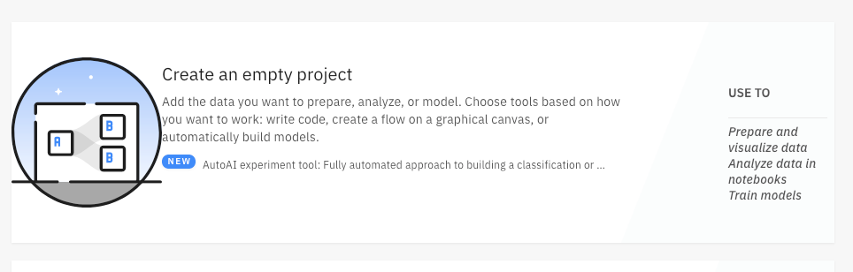
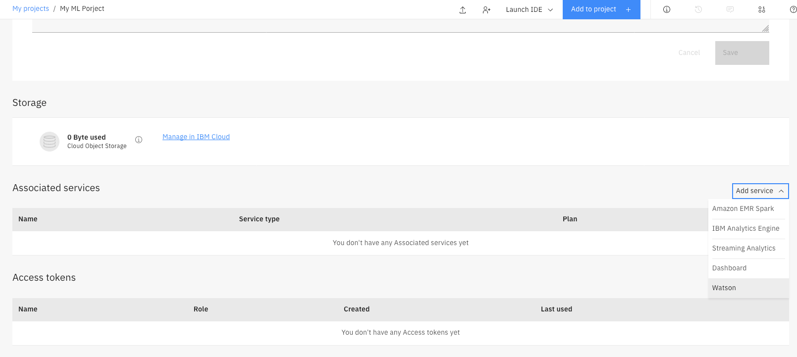
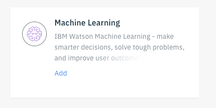

# Data Science using IBM Watson Studio Meetup

## Objectives:
The objectives for the meetup is:
  + Developing/Training and Deployment of AI/Predictive Models with IBM Watson Studio.  

It will cover **development, testing and deployment** thru different user experience.
So focus will be on:
+ Watson Studio
+ Watson Machine Learning
+ AutoAI.

Watson Open Scale is outside the scope of this workshop, this may be an idea for a second meetup.

**Format:**
+ 2 hours (1 hour lecture + 1 hour Hands-on-Labs)

## Pre-requisites
+ Create IBM ID
+ Instantiate a IBM Watson Studio service
+ Get your environment ready:
  1. Create a Watson Studio project. From Watson Studio click on **Create an empty Project**
  
  2. Add a Watson Machine Learning Service to your environment. From the project click **Settings** tab, scroll down to the **Associated Services** section.
  3. Click **Add Services** and select **Watson**.
  
  4. From the service list find and select **Machine Learning**. You add an existing one or create a new one. If you create a new service, select the **lite** plan.
  
  5. Retrieve the Machine Learning service credentials to save them in a notepad (you'll need those throughout the Labs). Open a new tab and go to https://cloud.ibm.com, use the same username/password that you used in Watson Studio.
  6. Under services, click on your machine learning service name. Select **Service credentials** from the left menu.
  7. Click on view credentials. We’ll be using those credentials later when scoring records from a notebook so make a copy of them for later.

+ At this point you have a configured environment and are ready to complete the Hands-on-Labs

## Lecture
+ IBM Watson Studio overview
+ Tools for Data Scientists:
  + Jupyter Notebooks
  + Modeler Flow
  + AutoAI
+ Deployment of trained models using Watson Machine Learning
+ Conclusion

## Hands-on-Labs
+ Multiclass Classification of Car Evaluation using Auto-AI: [Instructions Here](./Lab1.md)

+ Speed up Machine Learning development with Modeler Flows **Task 2 and Task 3**
https://www.ibm.com/cloud/garage/dte/tutorial/ibmr-watson-studio-speed-mldl-development-modeler-flows

+ Speed up Deep Learning development with Modeler Flows and Experiments (Building a Neural Net) **Task 5 and Task 6**
https://www.ibm.com/cloud/garage/dte/tutorial/ibmr-watson-studio-speed-mldl-development-modeler-flows
